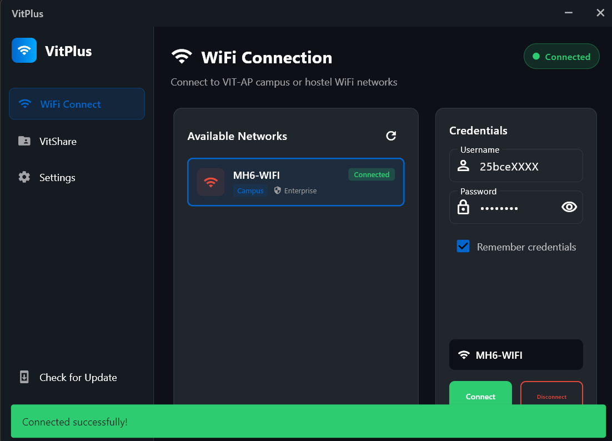

# VitPlus

<p align="center">
  
</p>

<p align="center">
  <strong>VIT-AP Campus WiFi Auto-Login & File Sharing App</strong>
</p>

<p align="center">
  <a href="https://github.com/notsachin07/VitPlus/releases/latest">
    
  </a>
  <a href="https://github.com/notsachin07/VitPlus/releases/latest">
    
  </a>
  <a href="https://github.com/notsachin07/VitPlus/stargazers">
    
  </a>
</p>

---

## 📥 Download

### [⬇️ Download VitPlus Setup (Windows)](https://github.com/notsachin07/VitPlus/releases/latest/download/VitPlus_Setup_2.1.1.exe)

Or visit the [Releases Page](https://github.com/notsachin07/VitPlus/releases) to see all versions.

---

## ✨ Features

### 🔐 WiFi Auto-Login
- **Campus Networks (VIT-AP, VITAP)**: Automatic captive portal authentication
- **Hostel Networks (MH4-WIFI, MH5-WIFI, etc.)**: One-click login
- **Enterprise Networks**: Guided setup for WPA2-Enterprise networks
- **Auto-reconnect**: Remembers your credentials for quick reconnection

### 📂 VitShare
- **Share Files**: Host files on your local network for others to download
- **Receive Files**: Download files from other VitShare servers using URL
- **Embedded Browser**: Built-in browser for easy file receiving
- **No Internet Required**: Works entirely on local network

### 🔄 Auto-Update
- Automatic update checking from GitHub releases
- Silent background updates

---

## 🚀 Installation

1. **Download** `VitPlus_Setup_2.1.1.exe` from the link above
2. **Run** the installer
3. **Follow** the installation wizard
4. **Launch** VitPlus from Start Menu or Desktop shortcut

✅ Appears in Windows "Installed Apps"  
✅ Creates Start Menu & Desktop shortcuts  
✅ Optional: Run at Windows startup  
✅ Easy uninstall via Windows Settings  

> **Note**: On first run, Windows may show a SmartScreen warning. Click "More info" → "Run anyway" to proceed.

---

## 📋 Requirements

- Windows 10/11 (64-bit)
- WiFi adapter
- **Location Services enabled** (required by Windows for WiFi scanning)

---

## 🛠️ Building from Source

### Prerequisites
- Flutter SDK (3.0.0 or higher)
- Windows development dependencies
- [Inno Setup 6](https://jrsoftware.org/isinfo.php) (for building installer)

### Steps
```bash
# Clone the repository
git clone https://github.com/notsachin07/VitPlus.git
cd VitPlus

# Get dependencies
flutter pub get

# Build release
flutter build windows --release

# Output will be in build/windows/x64/runner/Release/
```

---

## 📸 Screenshots



---

## 🤝 Contributing

Contributions are welcome! Feel free to:
- Report bugs
- Suggest features
- Submit pull requests

---

## ⭐ Star this repo

If you find this app useful, please consider giving it a star on GitHub!

[](https://github.com/notsachin07/VitPlus)

---

## 📄 License

This project is open source and available under the [MIT License](./LICENSE).

---

<p align="center">
  Made with ❤️ for VIT-AP students
</p>
